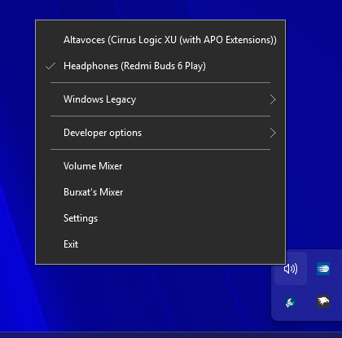

# Burxat's Mixer — an EarTrumpet expansion

This is a personal fork of [EarTrumpet](https://github.com/File-New-Project/EarTrumpet), the excellent open-source volume mixer for Windows created by [File-New-Project](https://github.com/File-New-Project). Everything EarTrumpet already does is still here, untouched — this branch simply adds **Burxat's Mixer**, a standalone console window for people who want a single screen with a fader for every output device *and* every input device (microphones included), a fader for every app, and a master fader for each side that moves everything together.

All credit for the original app — its design, its audio engine, its years of polish — belongs to the original EarTrumpet team. This fork exists to add one extra tool on top of their work, not to replace it. See [Credits](#credits) below.

## Download

Windows only. This build replaces EarTrumpet rather than adding onto it — **if you already have EarTrumpet installed** (Microsoft Store, winget, Chocolatey, or a previous manual copy), uninstall or remove it first, so its tray icon and this fork's don't end up running side by side.

1. Download and unzip the [latest release](https://github.com/Joanmarcgs/EarTrumpet/releases/latest) anywhere, e.g. `C:\Program Files\BurxatMixer`.
2. Run `EarTrumpet.exe` to start it normally, or run `BurxatMixer.exe` to start EarTrumpet and land straight in the mixer. Running `BurxatMixer.exe` again while it's already open just brings the mixer back to the front instead of starting a second copy.

## What Burxat's Mixer adds

Right-click EarTrumpet's tray icon and pick "Burxat's Mixer" to open it, alongside the regular EarTrumpet flyout.

### A console for every device and every app — outputs and inputs

The window is split into two zones, stacked in one scrollable view: your output (playback) devices on top, your input (recording) devices below, each with their own master fader. Every device gets its own column with its own fader, and every app currently using it gets its own fader nested under whichever device it's actually routed to. Apps that haven't been pinned anywhere are labeled "(by default)" and automatically follow whichever device is the current Windows default.

- **Master Fader** scales every device in its zone *relatively* — dragging it to 50% halves each device's current volume based on its own ratio, and dragging back to 100% restores exactly what you had. Outputs and inputs each get their own master fader, independent of each other.
- **Drag and drop** an app onto a different device's column (within the same zone) to move it there instantly — including microphones, for apps that let you pick an input device. Drag it onto a Master Fader's drop zone to reset it back to "follow the default device."
- **Double-click** a device's name, header, or the "Double-click to set as Default..." hint to make that device the new Windows default — for either outputs or inputs.

### Right-click device management

Right-click any device column — output or input — to set it as the default or disable it entirely, without leaving the mixer.

Disabling asks for confirmation first, since it's a device-level Windows setting, not just a mixer preference.

### Settings: scale, themes, behavior, and disabled devices

The gear icon in the title bar opens a separate settings window. Every change here applies instantly to the mixer, no restart or "Apply" button needed.

- **Scale** — resize the whole UI from 100% to 200%, for high-DPI displays or just bigger faders.
- **Themes** — six palettes: Dark, Standard, and Chocolate, each with a pixel-art "Retro" variant with its own font.
- **Start with Windows** — launch EarTrumpet automatically at sign-in.
- **Keep Burxat's Mixer on top** — pin the mixer window above other windows while you work.
- **Disabled devices** — see any playback *or recording* device Windows is currently hiding and re-enable it with one click, without digging through Control Panel.

The mixer window also remembers its size and position between launches, the same way the scale and theme choices do.

Here's the same mixer window in the Chocolate (Retro) theme:

### Also included
- Resizable window with minimize/maximize, and full support for Windows' Snap layouts.
- "Output Device 1", "Input Device 1", etc. labels so it's always clear which fader controls which device, with device columns that stay centered as you resize the window.
- `BurxatMixer.exe`, a small launcher (see [Download](#download)) that starts EarTrumpet and opens the mixer directly, or just raises it to the front if it's already running.

## For developers

Want to branch this out and build on it further? [BURXAT_MIXER_DEVELOPMENT.md](./BURXAT_MIXER_DEVELOPMENT.md) walks through what this fork adds on top of stock EarTrumpet: the file layout, how the two-zone mixer window is put together, the theming system, settings/persistence patterns, the launcher's activation protocol, and a few gotchas specific to this codebase that are worth knowing before you add new controls.

## Credits

- **EarTrumpet** — created by [David Golden](https://www.twitter.com/GoldenTao), [Rafael Rivera](https://www.twitter.com/WithinRafael), and [Dave Amenta](https://www.twitter.com/davux), and built by its [many contributors](https://github.com/File-New-Project/EarTrumpet/graphs/contributors). This fork stands entirely on top of their work — go star the [original repository](https://github.com/File-New-Project/EarTrumpet).
- **Burxat's Mixer** — interface and feature design by Burxat ([info@burxat.dev](mailto:info@burxat.dev)).
- Built with the assistance of [Claude](https://claude.com) (Anthropic).
