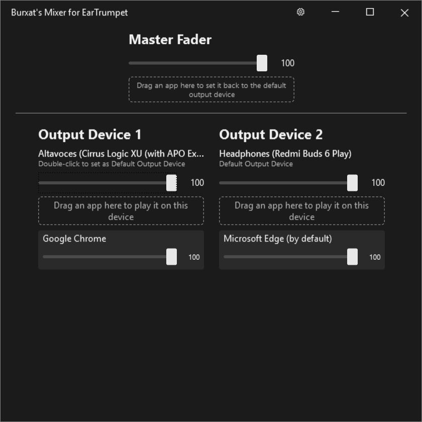
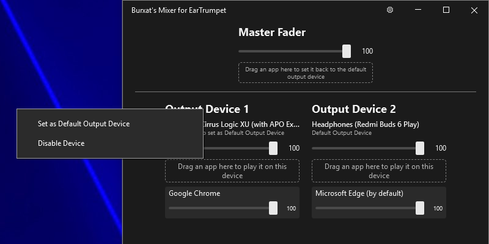
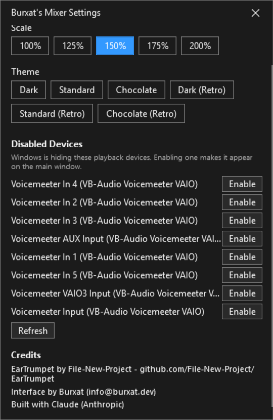
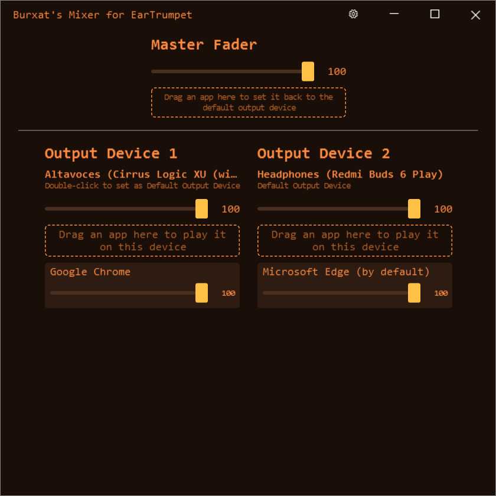

# Burxat's Mixer — an EarTrumpet expansion

This is a personal fork of [EarTrumpet](https://github.com/File-New-Project/EarTrumpet), the excellent open-source volume mixer for Windows created by [File-New-Project](https://github.com/File-New-Project). Everything EarTrumpet already does is still here, untouched — this branch simply adds **Burxat's Mixer**, a standalone console window for people who want a single screen with a fader for every output device, a fader for every app, and a master fader that moves them all together.

All credit for the original app — its design, its audio engine, its years of polish — belongs to the original EarTrumpet team. This fork exists to add one extra tool on top of their work, not to replace it. See [Credits](#credits) below.

## What Burxat's Mixer adds

Open it from the tray icon's context menu ("Burxat's Mixer") alongside the regular EarTrumpet flyout.

### A console for every device and every app

Each output device gets its own column with its own fader, and every app currently playing gets its own fader nested under whichever device it's actually playing on. Apps that haven't been pinned anywhere are labeled "(by default)" and automatically follow whichever device is the current Windows default.

- **Master Fader** scales every device *relatively* — dragging it to 50% halves each device's current volume based on its own ratio, and dragging back to 100% restores exactly what you had.
- **Drag and drop** an app onto a different device's column to move its audio there instantly. Drag it onto the Master Fader's drop zone to reset it back to "follow the default device."
- **Double-click** a device's name, header, or "Double-click to set as Default Output Device" hint to make that device the new Windows default.

### Right-click device management

Right-click any device column to set it as the default output device or disable it entirely, without leaving the mixer.

Disabling asks for confirmation first, since it's a device-level Windows setting, not just a mixer preference.

### Settings: scale, themes, and disabled devices

The gear icon in the title bar opens a separate settings window. Every change here applies instantly to the mixer, no restart or "Apply" button needed.

- **Scale** — resize the whole UI from 100% to 200%, for high-DPI displays or just bigger faders.
- **Themes** — six palettes: Dark, Standard, and Chocolate, each with a pixel-art "Retro" variant with its own font.
- **Disabled devices** — see any playback device Windows is currently hiding and re-enable it with one click, without digging through Control Panel.

Here's the same mixer window in the Chocolate (Retro) theme:

### Also included
- Resizable window with minimize/maximize, and full support for Windows' Snap layouts.
- "Output Device 1", "Output Device 2", etc. labels so it's always clear which fader controls which device, with device columns that stay centered as you resize the window.

## Credits

- **EarTrumpet** — created by [David Golden](https://www.twitter.com/GoldenTao), [Rafael Rivera](https://www.twitter.com/WithinRafael), and [Dave Amenta](https://www.twitter.com/davux), and built by its [many contributors](https://github.com/File-New-Project/EarTrumpet/graphs/contributors). This fork stands entirely on top of their work — go star the [original repository](https://github.com/File-New-Project/EarTrumpet).
- **Burxat's Mixer** — interface and feature design by Burxat ([info@burxat.dev](mailto:info@burxat.dev)).
- Built with the assistance of [Claude](https://claude.com) (Anthropic).
